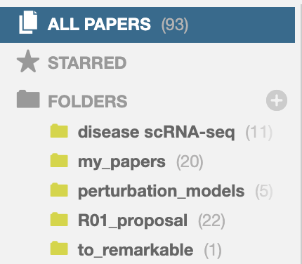

# Sync Paperpile to ReMarkable via Google Drive

Simple script to sync PDF files of papers between Paperpile library and ReMarkable via GDrive, for quick access to papers to read and storing of annotated files. 

## Requirements

1. [Google Drive for desktop](https://support.google.com/drive/answer/10838124?sjid=5971543940215022341-EU)
2. Sync of ReMarkable to laptop with [rmirro](https://github.com/hersle/rmirro/tree/main)
3. [Sync of Paperpile to Google Drive](https://paperpile.com/h/guide-google-drive/#:~:text=Google%20Drive%20syncing%20is%20initially,no%20manual%20action%20is%20required.)

## Usage

### First time set-up

- Make a `to_remarkable/` folder in Paperpile to store the papers you want to sync with ReMarkable

- Make a `To read` destination folder on ReMarkable 
- Sync ReMarkable and local filesystem via rmirro (takes a while to sync only the first time)
```
python3 rmirro.py
```

### Download papers to read
- Save files in `to_remarkable` folder in Paperpile
- Run `paperpile_sync.py` to upload papers from Paperpile to "To read" folder on ReMarkable (run `paperpile_sync.py --help` to see how to change default behaviour)
```
python3 paperpile_sync.py
``` 
- Push local changes to ReMarkable
```
python3 rmirro.py
``` 
- Move papers outside of `to_remarkable/` folder on Paperpile

### Upload read papers

- Read and annotate the papers on ReMarkable
- When you are ready to save, move papers outside of "To read" folder
- Sync ReMarkable locally
```
python3 rmirro.py
``` 
- Run `paperpile_sync.py` to sync annotated papers to Paperpile.
- Find annotated papers in Paperpile GDrive and apps. 

In my hands the sync between GDrive and Paperpile PDF readers is not super reliable. To always see my pdfs with annotations from the Paperpile app, I have changed the default PDF viewer (from Settings > General > PDF viewer, select "Google Drive")
